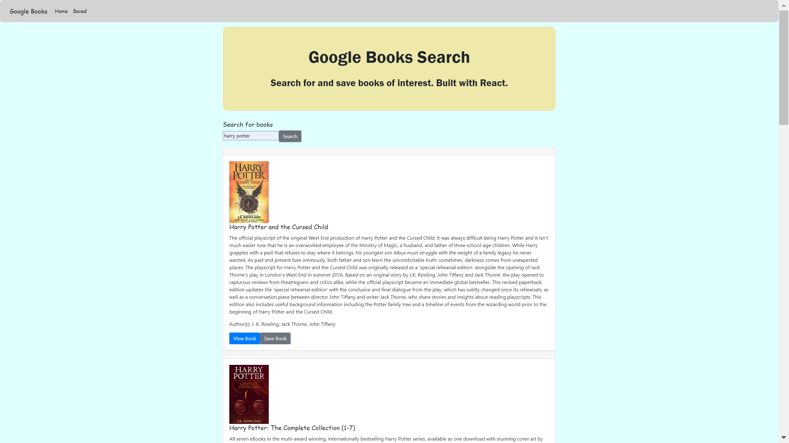
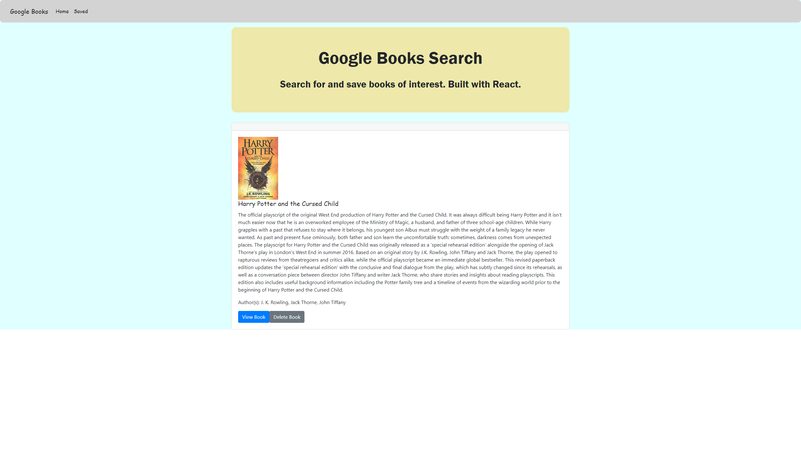

# Google Books Search - MERN App

## Description

This Google Books Search application was used MERN stack to build the front-end UI ( `the create-react-app` ) and the back-end DB (`MongoDB`, `Express JS` , `Node JS` and `Axios`). User is able to search for booKs via the Google Books API.

## Table of Contents

- [Useage](#Useage)
- [Usage](#Usage)
- [NPM-Packages--Dependencies-Used](#NPM-Packages--Dependencies-Used)
- [Directory-Structure](#Directory-Structure)
- [Screenshots](#screenshots)
- [Demo](#demo)
- [Deploy](#Deploy) - [Heroku](https://search-google-books-app.herokuapp.com/)
- [License](#license)
- [Questions](#questions)

## Usage

This application allows user to search google books using Google Books API. Users have the option to "Save" a book, saving it to the Mongo database. Users have the option to "View" the book, bringing them to the book on Google Books, or "Delete" a book, removing it from the Mongo database.

## Technologies Used

    - React
    - MongoDB ( Mongoose )
    - ES6
    - Express.js
    - Node.js
    - NPM packages: React-router, Express, Axios

## Screenshots

## Demo

## Deploy

This Google Book Search application is deployed on [Heroku](https://search-google-books-app.herokuapp.com/).

## License

## Questions

If you have any questions about this application, please feel free to reach me via the link of my [GitHub](https://github.com/aprilyanggarwood) and my Email: <aprilyanggarwood@gmail.com>
